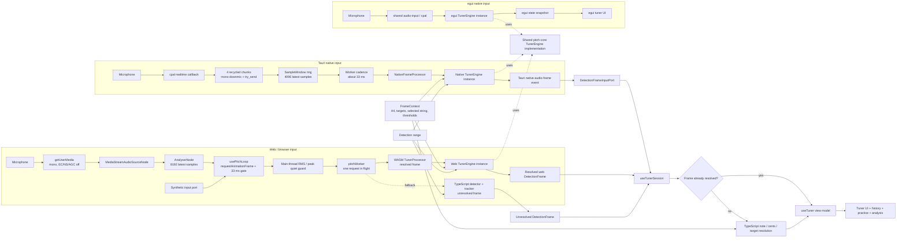
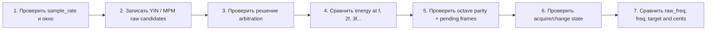

# Tuner Detection Pipeline

Этот документ показывает процесс определения высоты звука как набор небольших блоков. Он отделяет:

1. фактический pipeline текущего `main`;
2. внутренние решения `pitch-core`;
3. целевое SOLID/DRY-разбиение для следующего рефакторинга.

Главный сквозной контракт после обработки сигнала - `DetectionFrame`:

```text
freq | raw_freq | confidence | rms | level | cents | note | target | in_tune | is_power | spectrum
```

`raw_freq` показывает оценку детектора до подавления, tracking и hold. `freq` содержит уже принятую и стабилизированную частоту, которую можно показывать пользователю.

## 1. Фактический end-to-end pipeline



### Что важно в этой схеме

- Web microphone и synthetic input поставляют сырые `Float32Array` кадры. Их pitch detection запускается через `usePitchLoop`.
- Tauri native port поставляет уже готовый `DetectionFrame`; web worker для него не используется.
- WASM и native используют один Rust `TunerEngine`. TypeScript остается аварийным fallback с отдельным resolution на уровне web composition root.
- UI не должен знать, как получены samples. Он получает один frame contract и reactive view-model.
- Web и native сейчас анализируют окна разной длины: 8192 и 4096 samples соответственно. Поэтому их низкочастотная устойчивость и latency не полностью эквивалентны.

## 2. Процесс определения внутри `TunerEngine`

```mermaid
flowchart TD
  subgraph PRE["A. Предобработка сигнала"]
    Input["Окно аудио<br/>Mono samples и фактическая sample rate"] --> RawRms["P1. Исходный RMS<br/>Общая энергия до удаления DC"]
    RawRms --> Level["P2. Уровень для UI<br/>Масштабирует RMS для индикатора"]

    Input --> StatsMean["P3A. Оценка DC для SignalStats<br/>Среднее значение samples в окне"]
    StatsMean --> StatsPass["P4A. Расчет centered-признаков<br/>Вычитает среднее без сохранения samples"]
    StatsPass --> CenteredRms["P5A. Centered RMS<br/>Энергия для адаптивного gate"]
    StatsPass --> CenteredPeak["P5B. Centered peak<br/>Максимальный модуль sample"]
    CenteredRms --> Stats["SignalStats<br/>RMS и peak без влияния DC bias"]
    CenteredPeak --> Stats

    Input --> DetectorMean["P3B. Повторная оценка DC<br/>Детектор заново считает среднее окна"]
    DetectorMean --> Center["P4B. Centered scratch buffer<br/>Хранит samples без постоянной составляющей"]
    Center --> DetectorRms["P6A. Detector RMS<br/>Проверяет энергию для запуска алгоритмов"]
    Center --> DetectorPeak["P6B. Detector peak<br/>Проверяет пиковую амплитуду"]
    DetectorRms --> FixedGate{"P7. Фиксированный gate<br/>RMS и peak выше порогов?"}
    DetectorPeak --> FixedGate
  end

  subgraph CANDIDATES["B. Поиск и выбор pitch-кандидата"]
    FixedGate -- "нет" --> NoEstimate["Нет оценки<br/>Кадр недостаточно надежен"]
    FixedGate -- "да" --> Yin["YIN candidate<br/>Ищет период по разностной функции"]
    FixedGate -- "да" --> Mpm["MPM candidate<br/>Ищет период по пику NSDF"]
    Yin --> Arbitration["Арбитраж кандидатов<br/>Объединяет близкие оценки или выбирает сильнейшую"]
    Mpm --> Arbitration
    Prior["PitchPrior<br/>Выбранная струна и частоты текущего строя"] --> Arbitration
    Arbitration --> HarmonicNeed{"Нужна harmonic-проверка?<br/>Есть raw candidate, но итог отсутствует или не поддержан строем"}
    HarmonicNeed -- "нет" --> ConfidenceGate{"Порог confidence<br/>Есть кандидат с confidence не ниже 0.70?"}
    HarmonicNeed -- "да" --> Harmonic["Harmonic alternative<br/>Проверяет пять гармоник через Hann и Goertzel"]
    Prior --> Harmonic
    Harmonic --> Prefer["Сравнение альтернатив<br/>Выбирает measured или harmonic candidate"]
    Prefer --> ConfidenceGate
    ConfidenceGate -- "нет" --> NoEstimate
  end

  subgraph OCTAVE["C. Проверка октавы"]
    ConfidenceGate -- "да" --> Octave["Octave disambiguator<br/>Сравнивает спектральные признаки f/2, f и 2f"]
    Octave --> RawCapture["Диагностический raw_freq<br/>Частота после detector и octave decision"]
    RawCapture --> Pending{"Коррекция октавы ожидает подтверждения?<br/>Fold должен повториться на следующем кадре"}
    Pending -- "да" --> Suppress["Временное подавление<br/>Не передает сомнительную частоту в tracker"]
    Pending -- "нет" --> Estimate["PitchEstimate<br/>Частота и confidence готовы для tracking"]
  end

  subgraph STABILITY["D. Gate и временная стабилизация"]
    Stats --> AdaptiveGate["AdaptiveSignalGate<br/>Учитывает шумовой фон, onset, confidence и цель"]
    RawCapture --> GateEstimate["Gate estimate<br/>Сохраняет detector result до временного подавления"]
    GateEstimate --> AdaptiveGate
    NoEstimate --> AdaptiveGate
    Prior --> AdaptiveGate
    AdaptiveGate --> GateOpen{"Адаптивный gate открыт?<br/>Можно обновлять пользовательское состояние?"}
    GateOpen -- "нет" --> Clear["Полный reset pitch state<br/>Очищает tracker, hold, resolver и octave state"]
    GateOpen -- "да" --> Publishable{"Есть estimate после suppression?<br/>Проверяет значение для текущего кадра"}
    Estimate --> Publishable
    Suppress --> Publishable
    NoEstimate --> Publishable
    Publishable -- "да" --> Correction{"Подтверждена новая octave correction?<br/>Нужно ли сбросить старое сглаживание?"}
    Correction -- "да" --> FreshTrack["Новый track<br/>Удаляет историю ошибочной октавы"]
    Correction -- "нет" --> Tracker["PitchTracker<br/>Подтверждает изменения и сглаживает log-frequency"]
    FreshTrack --> Tracker
    Tracker --> TrackDecision{"Получена стабильная частота?<br/>Достаточно последовательных согласованных кадров?"}
    TrackDecision -- "да" --> Accepted["Принятая частота<br/>Обновляет freq, confidence и held reading"]
    TrackDecision -- "нет" --> Empty["Пустой результат<br/>Tracker еще не подтвердил pitch"]
    Publishable -- "нет" --> Hold{"Можно удержать прошлую частоту?<br/>Сигнал есть и прошло меньше шести кадров"}
    Hold -- "да" --> Accepted
    Hold -- "нет" --> Clear
  end

  subgraph OUTPUT["E. Музыкальное разрешение и результат"]
    Accepted --> Power["Проверка power chord<br/>Измеряет корреляцию на частоте квинты"]
    Accepted --> Resolver["FrameResolver<br/>Выбирает note/target, считает cents и in-tune"]
    Empty --> Resolver
    Clear --> Resolver
    Input --> Spectrum["Опциональный spectrum<br/>Считается только когда анализатор явно включен"]
    Power --> Frame["DetectionFrame<br/>Единый результат для session и UI"]
    Resolver --> Frame
    Spectrum --> Frame
    Level --> Frame
    Frame --> Ui["Интерфейс тюнера<br/>Показывает ноту, cents, уровень и историю"]
  end
```



### Предобработка по блокам

| Блок | Операция | Зачем нужна | Что важно |
| --- | --- | --- | --- |
| P1 Raw RMS | `sqrt(sum(x[n]^2) / N)` | Публичные `rms` и общий уровень входа | Считается по исходному сигналу, до удаления DC |
| P2 Display level | `min(raw_rms, 1) * 18` | Масштаб для индикатора громкости | Это шкала UI, а не вероятность и не строго нормализованный диапазон `0..1` |
| P3A DC estimate | `mean = sum(x[n]) / N` | Подготовка unbiased statistics для adaptive gate | DC bias микрофона не должен открывать gate |
| P4A Centered-statistics pass | Для каждого sample вычисляется `y[n] = x[n] - mean` | Получение centered energy и peak | Центрированные samples здесь не сохраняются |
| P5A Centered RMS | `sqrt(sum(y[n]^2) / N)` | Noise-floor, onset, open/close решения | Передается в `AdaptiveSignalGate` как `SignalStats.rms` |
| P5B Centered peak | `max(abs(y[n]))` | Отсечение слишком слабого или импульсного шума | Передается в `AdaptiveSignalGate` как `SignalStats.peak` |
| P3B Detector DC estimate | Детектор повторно вычисляет frame mean | Подготовка собственного scratch buffer | Это второй владелец той же операции |
| P4B Detector centering | Записывает `x[n] - mean` в переиспользуемый `Vec<f32>` | YIN, MPM, harmonic и octave получают centered samples | После прогрева scratch не требует per-frame allocation |
| P6 Detector RMS/peak | Еще один проход по centered scratch | Локальная защита математики детектора | Не переиспользует уже рассчитанный `SignalStats` |
| P7 Fixed detector gate | По умолчанию `rms >= 0.0025` и `peak >= 0.012` | Не запускать YIN/MPM на заведомо слабом кадре | Это отдельный fixed gate до адаптивного пользовательского gate |

`DC removal` здесь означает только вычитание среднего значения текущего окна. Это не high-pass filter: постоянное смещение убирается, но низкочастотный гул и медленный drift могут остаться.

Сейчас до запуска YIN/MPM выполняется примерно шесть полных проходов по frame: один для raw RMS, два для centered `SignalStats` и три внутри `HybridPitchDetector::prepare_centered`. Это не шесть разных DSP-преобразований, а повторное чтение тех же samples.

Целевая граница - один `Preprocessor`, который за два прохода формирует единый результат:

```text
PreprocessedFrame = {
  centered_samples,
  dc_offset,
  raw_rms,
  centered_rms,
  centered_peak,
  display_level
}
```

Первый проход считает `sum` и raw `sum_sq`; второй одновременно записывает centered scratch и считает centered `sum_sq`/peak. `TunerEngine`, fixed gate, adaptive gate, YIN и MPM после этого получают готовые признаки, не вычисляя их повторно.

### Порядок решений, без деталей реализации

1. **Захват окна.** Pipeline получает последние mono samples и реальную `sample_rate`.
2. **Проверка сигнала.** Считаются RMS, peak и centered statistics; слишком тихий кадр отбрасывается.
3. **Независимые измерения.** YIN и MPM предлагают частоту и normalized-periodicity confidence.
4. **Арбитраж кандидатов.** Близкие оценки объединяются; конфликтующие проходят правила confidence и target guidance.
5. **Проверка гармоник.** Если выбранная нота не поддерживается текущим строем, guided detector ищет фундаментальную частоту по пяти гармоникам.
6. **Исправление октавы.** Octave disambiguator сравнивает spectral evidence для `f/2`, `f` и `2f`; включение fold требует двух кадров подтверждения, выключение происходит сразу после выхода за hysteresis threshold.
7. **Адаптивный gate.** Noise floor, onset, signal level, confidence и близость к выбранной струне решают, можно ли обновлять tracking.
8. **Временная стабилизация.** Tracker подтверждает новую частоту, сглаживает log-frequency и не позволяет одиночному выбросу сменить ноту.
9. **Hold или reset.** Короткий detector dropout удерживает последнее значение до шести кадров; закрытый gate очищает состояние.
10. **Музыкальное разрешение.** `FrameResolver` выбирает target, вычисляет note/cents и применяет hysteresis для `in_tune`.
11. **Публикация.** Частота, диагностическая raw frequency, качество сигнала и музыкальное представление собираются в `DetectionFrame`.

## 3. Контракты блоков текущей реализации

| ID | Блок | Вход | Выход | Текущий владелец |
| --- | --- | --- | --- | --- |
| B01 | Browser capture | media constraints, device id | `MediaStream` | `web/src/composables/useAudioInput.ts` |
| B02 | Browser window | audio stream | latest 8192 mono samples | `AnalyserNode` in `useAudioInput.ts` |
| B03 | Browser scheduler | frame source, wall clock | at most one worker request per 33 ms | `web/src/composables/usePitchLoop.ts` |
| B04 | Worker transport | transferable sample buffer + context | backend result + recycled buffer | `web/src/workers/pitchWorker.ts` |
| B05 | Native capture | cpal interleaved samples | recycled mono chunks | `audio-input/src/lib.rs` |
| B06 | Native window/scheduler | chunks | latest 4096-sample window about every 33 ms | `audio-input/src/lib.rs` |
| B07a | Raw level | audio window | raw RMS + display level | `pitch-core/src/signal.rs` |
| B07b | Gate statistics | audio window | centered RMS + peak | `pitch-core/src/signal.rs` |
| B07c | Detector centering | audio window | centered scratch + repeated RMS/peak | `pitch-core/src/dsp/detector.rs` |
| B07d | Fixed detector gate | detector RMS/peak + config | continue or no estimate | `pitch-core/src/dsp/detector.rs` |
| B08 | Candidate providers | centered samples | YIN and MPM `PitchEstimate` values | `pitch-core/src/dsp/yin.rs`, `mpm.rs` |
| B09 | Arbitration | candidates + `PitchGuidance` | one candidate or none | `pitch-core/src/dsp/candidates.rs` |
| B10 | Harmonic alternative | samples + target frequencies | target-adjacent candidate | `pitch-core/src/dsp/harmonic.rs` |
| B11 | Octave decision | samples + candidate | retained/folded candidate + pending state | `pitch-core/src/dsp/octave.rs` |
| B12 | Adaptive gate | stats + estimate + prior | open/closed decision | `pitch-core/src/gate.rs` |
| B13 | Temporal tracker | accepted estimates + prior | stable tracked pitch | `pitch-core/src/tracking.rs` |
| B14 | Resolution | stable frequency + `FrameContext` | note, target, cents, `in_tune` | `pitch-core/src/resolution.rs` |
| B15 | Orchestration | all blocks above | canonical `DetectionFrame` | `pitch-core/src/engine.rs`, `frames.rs` |
| B16 | Session routing | raw-frame or resolved-frame input port | active session frame | `web/src/composables/useTunerSession.ts` |
| B17 | Presentation fallback | unresolved TS frame + tuning state | resolved web frame | `web/src/composables/useTuner.ts` |

## 4. Временная модель и ожидаемая задержка

| Участок | Текущее значение | При 48 kHz | При 44.1 kHz |
| --- | ---: | ---: | ---: |
| Web analysis window | 8192 samples | 170.7 ms | 185.8 ms |
| Native analysis window | 4096 samples | 85.3 ms | 92.9 ms |
| Номинальный detection cadence | 33 ms | около 30 fps | около 30 fps |
| Acquire новой стабильной частоты | 2 frames | около 33-66 ms после появления подходящего окна | то же |
| Подтверждение octave correction | 2 frames | около 33 ms дополнительного ожидания | то же |
| Обычная смена track | 3 frames | около 99 ms | около 99 ms |
| Смена на другую октаву | 7 frames | около 231 ms | около 231 ms |
| Detector dropout hold | до 6 frames | около 198 ms | около 198 ms |
| Web quiet display hold | 8 animation frames | около 133 ms при 60 Hz | зависит от refresh rate |

Analysis window является ретроспективным интервалом, а frame rules частично перекрываются. Эти числа нельзя просто сложить и назвать latency. Фактическую задержку нужно измерять от sample index onset до первого стабильного `DetectionFrame`, отдельно для web, Tauri и egui.

## 5. Где искать ошибку `E2 около 82 Hz -> E3 около 165 Hz`



Диагностическая интерпретация:

- `raw_freq ~= 165`, `freq ~= 165`: ошибка возникает внутри detector, обычно в YIN/MPM arbitration, guided harmonic alternative или octave evidence.
- `raw_freq ~= 82`, `freq ~= 165`: detector уже вернул правильную октаву; значение изменили target-guided tracking, старый track или hold.
- `raw_freq == null`, `freq ~= 165`: detector не дал оценку, а pipeline временно показывает held reading предыдущего track.
- `freq ~= 82`, но note/cents показывают E3: detector исправен, ошибка находится в `FrameContext` или `FrameResolver`.
- Web ошибается, native нет: сначала сравниваются sample rate, window size, браузерные audio settings и WASM/fallback semantics.
- Оба backend-а ошибаются одинаково: нужен replay одного и того же WAV через `TunerEngine` с trace каждого блока.

Для полного объяснения одного сбоя текущему `DetectionFrame` не хватает массива кандидатов, причин gate decision, octave evidence, tracker phase и sample timestamp. Эти данные следует отдавать в отдельный opt-in diagnostics frame, а не раздувать UI contract.

## 6. Целевой модульный pipeline

Ниже не описание уже выполненного кода, а целевая граница модулей. Она сохраняет измерительный DSP независимым от UI и музыкальных предпочтений пользователя.

```mermaid
flowchart LR
  InputPort["AudioInputPort"] --> Chunk["AudioChunk<br/>samples, sample_rate, start_sample"]
  Chunk --> RingBuffer["Mono RingBuffer"]
  RingBuffer --> Planner["WindowPlanner<br/>short / long windows + sample-time hops"]
  Planner --> Preprocess["Preprocessor<br/>DC, window, level, clipping"]
  Preprocess --> Phase["SignalPhaseClassifier<br/>silence / attack / sustain / release"]

  Preprocess --> Providers["CandidateProvider set<br/>YIN, MPM, spectral or phase"]
  SearchPolicy["SearchPolicy<br/>range + optional selected-target hint"] --> Providers
  Providers --> Lattice["CandidateLattice<br/>multiple frequencies per frame"]
  Lattice --> Evidence["EvidenceFusion<br/>periodicity, harmonicity, phase, SNR"]
  Preprocess --> Evidence
  Phase --> Evidence
  Evidence --> OctaveModel["Octave / harmonic / inharmonicity model"]
  OctaveModel --> Tracker["TemporalPitchTracker<br/>time-based state + candidate sequence"]
  Phase --> Tracker
  Tracker --> Calibration["ConfidenceCalibrator<br/>quality vector -> calibrated score"]
  Calibration --> Tracked["TrackedPitch<br/>freq + uncertainty + state"]
  Tracked --> Resolver["NoteResolver<br/>A4, temperament, target, cents hysteresis"]
  MusicContext["MusicContext"] --> SearchPolicy
  MusicContext --> Resolver
  Resolver --> Frame["DetectionFrame"]
  Frame --> Presenter["TunerPresenter / feature ports"]

  Chunk -.-> Replay["Replay + benchmark harness"]
  Lattice -.-> Diagnostics["Opt-in DiagnosticsFrame"]
  Evidence -.-> Diagnostics
  Tracker -.-> Diagnostics
  Frame -.-> Telemetry["Latency / dropout / octave metrics"]
```



### Предлагаемые маленькие типы

```text
AudioChunk       = samples + sample_rate + start_sample
AnalysisWindow   = samples view + start_sample + end_sample + window_kind
SignalFeatures   = dc_offset + raw_rms + centered_rms + peak + snr + clipping
PreprocessedFrame = centered_samples + SignalFeatures
SignalPhase      = silence | attack | sustain | release
PitchCandidate   = frequency + source + periodicity + harmonicity + uncertainty
CandidateLattice = frame_time + all independent candidates
TrackedPitch     = frequency + confidence + uncertainty + tracker_state
ResolvedPitch    = note + target + cents + in_tune
DetectionFrame   = stable public UI contract
DiagnosticsFrame = optional evidence and decision trace
```

### Правила слабой связанности

1. `AudioInputPort` ничего не знает о нотах, строях, YIN или Vue.
2. `WindowPlanner` работает по sample index, а не по `requestAnimationFrame` или wall-clock ticks.
3. Каждый `CandidateProvider` возвращает кандидатов, но не выбирает ноту и не сглаживает UI.
4. `EvidenceFusion` видит измеримые признаки; выбранная струна может сузить search policy, но не должна подменять плохое измерение target frequency.
5. `TemporalPitchTracker` хранит время в samples/milliseconds, поэтому одинаково работает при 30, 60 или пропущенных frames.
6. `NoteResolver` не видит audio buffer. Его можно тестировать обычными таблицами частот.
7. `DetectionFrame` остается стабильным контрактом продукта. Подробная DSP-трасса живет отдельно и включается только для диагностики.
8. Browser, Tauri, egui, synthetic и будущий WAV adapter проходят одинаковые contract и replay tests.

## 7. Рекомендуемый порядок выделения блоков

1. Добавить `AudioChunk.start_sample` и измерение end-to-end latency без изменения detector logic.
2. Вынести единый `WindowPlanner` и сделать web/native window/cadence явно конфигурируемыми.
3. Ввести `DiagnosticsFrame` и записывать YIN, MPM, harmonic и octave evidence на fixture/replay запусках.
4. Представить результаты детекторов как список `PitchCandidate`, сохранив текущую arbitration policy.
5. Перевести tracker, gate, hold и octave confirmation с количества frames на elapsed sample time.
6. Добавить явный `SignalPhaseClassifier` и разные policies для attack/sustain/release.
7. Ввести multi-candidate temporal tracking, затем проверить его на real guitar WAV corpus.
8. После benchmark заменить target-guided harmonic heuristics на доказанно более точный evidence model.
9. Унифицировать 4096/8192 или осознанно оставить multi-resolution windows с одинаковыми latency budgets.
10. Зафиксировать parity tests: один WAV должен давать сопоставимые candidates, frequency и transition timing во всех backend-ах.

## 8. Карта исходников

- Web capture: [`web/src/composables/useAudioInput.ts`](web/src/composables/useAudioInput.ts)
- Web scheduling: [`web/src/composables/usePitchLoop.ts`](web/src/composables/usePitchLoop.ts)
- Worker boundary: [`web/src/workers/pitchWorker.ts`](web/src/workers/pitchWorker.ts)
- WASM adapter: [`web/src/workers/pitchCoreAdapter.ts`](web/src/workers/pitchCoreAdapter.ts)
- Input routing: [`web/src/composables/useTunerSession.ts`](web/src/composables/useTunerSession.ts)
- Web composition: [`web/src/composables/useTuner.ts`](web/src/composables/useTuner.ts)
- Native capture/window: [`audio-input/src/lib.rs`](audio-input/src/lib.rs)
- Tauri stream/frame adapters: [`desktop/src-tauri/src/native_audio/`](desktop/src-tauri/src/native_audio/)
- Engine orchestration: [`pitch-core/src/engine.rs`](pitch-core/src/engine.rs)
- Hybrid detector: [`pitch-core/src/dsp/detector.rs`](pitch-core/src/dsp/detector.rs)
- Candidate arbitration: [`pitch-core/src/dsp/candidates.rs`](pitch-core/src/dsp/candidates.rs)
- Harmonic alternative: [`pitch-core/src/dsp/harmonic.rs`](pitch-core/src/dsp/harmonic.rs)
- Octave decision: [`pitch-core/src/dsp/octave.rs`](pitch-core/src/dsp/octave.rs)
- Adaptive gate: [`pitch-core/src/gate.rs`](pitch-core/src/gate.rs)
- Temporal tracker: [`pitch-core/src/tracking.rs`](pitch-core/src/tracking.rs)
- Note/cents resolution: [`pitch-core/src/resolution.rs`](pitch-core/src/resolution.rs)
- Public frame: [`pitch-core/src/frames.rs`](pitch-core/src/frames.rs)
